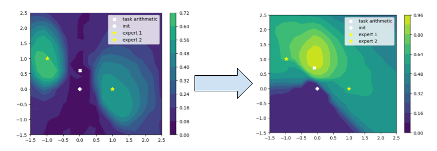
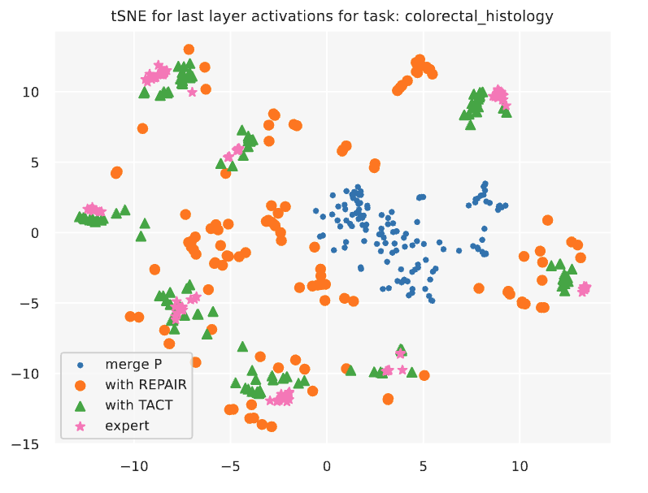

# The Non-Local Model Merging: Permutation Symmetries and Variance Collapse





Code release for [The Non-Local Model Merging: Permutation Symmetries and Variance Collapse](https://arxiv.org/).

## Setup

1. Create an virtual environment

```
python3 -m venv env
source env/bin/activate
```

2. Install dependencies 
```
python -m pip install -r requirements.txt -f https://storage.googleapis.com/jax-releases/jax_cuda_releases.html 
```

3. Download model checkpoints and datasets.

4. Update the paths in [constants.py](constants.py). 


### Model checkpoints

We release the following model checkpoints used for our experiments:

| Models + init  | [CASSAVA](https://www.tensorflow.org/datasets/catalog/cassava)  | [CIFAR10](https://www.tensorflow.org/datasets/catalog/cifar10)  | [CIFAR100](https://www.tensorflow.org/datasets/catalog/cifar100)  | [Colorectal Histology](https://www.tensorflow.org/datasets/catalog/colorectal_histology)  | [EuroSAT](https://www.tensorflow.org/datasets/catalog/eurosat)  | [Food101](https://www.tensorflow.org/datasets/catalog/food101)  | [Oxford Flowers102](https://www.tensorflow.org/datasets/catalog/oxford_flowers102)  | [Oxford IIIT Pet](https://www.tensorflow.org/datasets/catalog/oxford_iiit_pet)   | [RESISC45](https://www.tensorflow.org/datasets/catalog/resisc45)  | [Stanford dogs](https://www.tensorflow.org/datasets/catalog/stanford_dogs) | [SUN397](https://www.tensorflow.org/datasets/catalog/sun397)  |  [SVHN](https://www.tensorflow.org/datasets/catalog/svhn_cropped)  |
|---|---|---|---|---|---|---|---|---|---|---|---|---|
| [VGG16-A](https://huggingface.co/ekanshs/VGG16x2-0)  | [HF-repo](https://huggingface.co/ekanshs/VGG16x2-0-cassava) |  [HF-repo](https://huggingface.co/ekanshs/VGG16x2-0-cifar10)   |  [HF-repo](https://huggingface.co/ekanshs/VGG16x2-0-cifar100)   |  [HF-repo](https://huggingface.co/ekanshs/VGG16x2-0-colorectal_histology)   |  [HF-repo](https://huggingface.co/ekanshs/VGG16x2-0-eurosat)   |  [HF-repo](https://huggingface.co/ekanshs/VGG16x2-0-food101)    |  [HF-repo](https://huggingface.co/ekanshs/VGG16x2-0-oxford_flowers102)   |  [HF-repo](https://huggingface.co/ekanshs/VGG16x2-0-oxford_iiit_pet)   |  [HF-repo](https://huggingface.co/ekanshs/VGG16x2-0-resisc45)   |  [HF-repo](https://huggingface.co/ekanshs/VGG16x2-0-stanford_dogs)   |  [HF-repo](https://huggingface.co/ekanshs/VGG16x2-0-sun397)   |  [HF-repo](https://huggingface.co/ekanshs/VGG16x2-0-svhn_cropped)   |  
| [VGG16-B](https://huggingface.co/ekanshs/VGG16x2-1)  | [HF-repo](https://huggingface.co/ekanshs/VGG16x2-1-cassava) |  [HF-repo](https://huggingface.co/ekanshs/VGG16x2-1-cifar10)   |  [HF-repo](https://huggingface.co/ekanshs/VGG16x2-1-cifar100)   |  [HF-repo](https://huggingface.co/ekanshs/VGG16x2-1-colorectal_histology)   |  [HF-repo](https://huggingface.co/ekanshs/VGG16x2-1-eurosat)   |  [HF-repo](https://huggingface.co/ekanshs/VGG16x2-1-food101)    |  [HF-repo](https://huggingface.co/ekanshs/VGG16x2-1-oxford_flowers102)   |  [HF-repo](https://huggingface.co/ekanshs/VGG16x2-1-oxford_iiit_pet)   |  [HF-repo](https://huggingface.co/ekanshs/VGG16x2-1-resisc45)   |  [HF-repo](https://huggingface.co/ekanshs/VGG16x2-1-stanford_dogs)   |  [HF-repo](https://huggingface.co/ekanshs/VGG16x2-1-sun397)   |  [HF-repo](https://huggingface.co/ekanshs/VGG16x2-1-svhn_cropped)   |
| [ViT-B16 (ILSVRC-1k)](https://huggingface.co/ekanshs/ViTmaeB16) | [HF-repo](https://huggingface.co/ekanshs/ViTmaeB16-cassava) |  [HF-repo](https://huggingface.co/ekanshs/ViTmaeB16-cifar10)   |  [HF-repo](https://huggingface.co/ekanshs/ViTmaeB16-cifar100)   |  [HF-repo](https://huggingface.co/ekanshs/ViTmaeB16-colorectal_histology)   |  [HF-repo](https://huggingface.co/ekanshs/ViTmaeB16-eurosat)   |  [HF-repo](https://huggingface.co/ekanshs/ViTmaeB16-food101)    |  [HF-repo](https://huggingface.co/ekanshs/ViTmaeB16-oxford_flowers102)   |  [HF-repo](https://huggingface.co/ekanshs/ViTmaeB16-oxford_iiit_pet)   |  [HF-repo](https://huggingface.co/ekanshs/ViTmaeB16-resisc45)   |  [HF-repo](https://huggingface.co/ekanshs/ViTmaeB16-stanford_dogs)   |  [HF-repo](https://huggingface.co/ekanshs/ViTmaeB16-sun397)   |  [HF-repo](https://huggingface.co/ekanshs/ViTmaeB16-svhn_cropped)   |
| [ViT-B16 (ILSVRC-21k)](https://huggingface.co/ekanshs/ViTB16)  | [HF-repo](https://huggingface.co/ekanshs/ViTB16-cassava) |  [HF-repo](https://huggingface.co/ekanshs/ViTB16-cifar10)   |  [HF-repo](https://huggingface.co/ekanshs/ViTB16-cifar100)   |  [HF-repo](https://huggingface.co/ekanshs/ViTB16-colorectal_histology)   |  [HF-repo](https://huggingface.co/ekanshs/ViTB16-eurosat)   |  [HF-repo](https://huggingface.co/ekanshs/ViTB16-food101)    |  [HF-repo](https://huggingface.co/ekanshs/ViTB16-oxford_flowers102)   |  [HF-repo](https://huggingface.co/ekanshs/ViTB16-oxford_iiit_pet)   |  [HF-repo](https://huggingface.co/ekanshs/ViTB16-resisc45)   |  [HF-repo](https://huggingface.co/ekanshs/ViTB16-stanford_dogs)   |  [HF-repo](https://huggingface.co/ekanshs/ViTB16-sun397)   |  [HF-repo](https://huggingface.co/ekanshs/ViTB16-svhn_cropped)   |


## Notebooks 
* The notebook for [non-local-merging](notebooks/non-local-merging.ipynb). Evaluates merging modulo permutation, REPAIR, and TACT.

* The notebook for [local-merging](notebooks/local-merging.ipynb). Evaluates Vanilla merging and TACT merging


